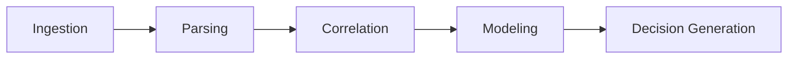

# IntelliCredit — AI Corporate Credit Intelligence Platform

**IntelliCredit** is an enterprise-grade AI platform designed to modernize how banks and financial institutions evaluate corporate credit risk.

Traditional credit underwriting relies heavily on manual financial statement analysis, fragmented data sources, and subjective judgment. IntelliCredit replaces this with a **fully automated, explainable, multi-dimensional intelligence system** capable of analyzing structured and unstructured financial data in seconds.

The platform provides **deep risk visibility, predictive financial insights, and institutional-grade explainable AI**, enabling credit officers to make faster and more reliable lending decisions.

---

# Platform Overview

IntelliCredit transforms corporate credit evaluation into a **data-driven intelligence workflow** powered by advanced AI modules.

### Core Objectives

• Automate financial risk analysis
• Detect hidden risk signals across multiple data layers
• Provide explainable AI for regulatory compliance
• Enable faster and more accurate credit decisions

---

# System Architecture

The platform follows a **multi-layered architecture** combining modern frontend technologies with an AI-driven intelligence layer.

### Frontend Layer

* React 18+
* TypeScript
* Tailwind CSS
* Motion (React animations)
* Recharts (data visualization)

### Intelligence Layer

Parallel AI engines responsible for financial analysis, risk modeling, and predictive insights.

### Data Layer

The platform integrates financial and behavioral signals from multiple sources:

* GST filings
* Bank statements
* Tax returns
* Legal records
* News and market sentiment

### Security Layer

* AES-256 encryption
* Secure document ingestion
* SOC2-ready architecture
* Audit trail support for regulatory compliance

---

# User Workflow (Credit Officer Journey)

The IntelliCredit platform is designed around the real workflow of institutional credit analysts.

### 1. System Initialization

The platform launches with a professional **system boot sequence** where all AI intelligence modules initialize and confirm operational status.

### 2. Landing Page

A high-level overview introduces IntelliCredit capabilities with a **product demo video and feature highlights**.

### 3. Portfolio Management

Credit officers monitor the entire loan portfolio and active applications within the **Portfolio Dashboard**.

### 4. Application Intake

Users upload corporate documents such as:

* GST reports
* Bank statements
* Financial documents

These are securely ingested into the analysis pipeline.

### 5. AI Analysis Pipeline

Documents pass through a **5-stage intelligence pipeline**:



Each stage runs in real time and provides progress tracking.

### 6. Credit Dashboard

The system generates a **Risk Snapshot** including:

* Risk score
* AI recommendation
* Key financial indicators
* Machine-discovered insights

### 7. Risk Deep Dive

The **Risk Explorer** allows detailed analysis through advanced financial visualizations.

### 8. AI Module Monitoring

Credit teams can inspect each AI module’s activity, insights, and health status.

### 9. Decision Workbench

Final credit decisions are made here, where officers can:

* Approve
* Reject
* Request review
* Generate the official Credit Memo

---

# Platform Pages

## Landing Page

Purpose: Product introduction and platform positioning.

Key Elements:

* Hero section: *Next-Gen Decision Intelligence*
* Demo video section
* Core module overview
* Institutional impact metrics

Interactive Features:

* Smooth navigation
* Hover-interactive modules
* Call-to-action elements

---

## Portfolio Dashboard

Purpose: Centralized management of credit applications.

Features:

* Total exposure analytics
* Average risk score
* Application status tracking
* Search and filtering capabilities

Application statuses include:

* Ready
* Analyzing
* Approved
* Rejected

---

## Application Intake

Purpose: Secure ingestion of financial documents.

Features:

* Drag-and-drop file upload
* Document metadata tracking
* Visual analysis pipeline stepper
* Real-time progress indicators

---

## Credit Dashboard

Purpose: Executive summary of a specific credit evaluation.

Displayed Insights:

* Overall risk score (0–100)
* AI recommendation
* Risk indicator bars
* Machine-generated insights

Users can quickly navigate to deeper analytics or finalize decisions.

---

## Risk Explorer

Purpose: Advanced financial risk analysis.

Key Visual Tools:

### Financial Stability Radar

Multi-axis comparison against industry peers:

* Liquidity
* Solvency
* Profitability
* Leverage
* Operational stability

### Revenue Trend Analysis

Line chart comparing:

* Company revenue
* Industry average

### Cash Flow Velocity

Area chart visualizing daily transaction velocity.

### Scenario Simulator

Interactive **what-if simulations** allow users to test:

* Revenue shocks
* Debt increases
* Economic downturns

The system instantly recalculates the risk score.

---

## AI Module Monitor

Purpose: Transparency and operational monitoring of AI engines.

Displays:

* Status of all AI modules
* System health indicators
* Insight generation logs
* Audit timeline

---

## Decision Workbench

Purpose: Final credit decision and documentation.

Capabilities:

* AI recommendation summary
* Key decision drivers
* Suggested loan conditions
* Credit memo generation

Officers can attach notes and export decision reports.

---

# AI Intelligence Modules

The platform includes multiple specialized AI engines designed to analyze corporate financial behavior.

### Digital Twin Stress Tester

Simulates **10,000+ economic scenarios** to test corporate resilience.

### GST Time Series Oracle

Uses deep learning to forecast **revenue stability and tax compliance patterns**.

### Network Contagion Scoring

Maps systemic risks from **supplier and buyer dependencies**.

### UPI Cash Velocity Engine

Analyzes transaction flow speed to evaluate **real-time liquidity health**.

### Management DNA Profiler

Assesses leadership reliability using behavioral and historical indicators.

### Economic Sentiment Analyzer

Uses NLP to extract macroeconomic signals from **news and market reports**.

---

# Specialized UX Features

### Financial Stability Radar

A multi-dimensional visualization of financial risk.

### Explainable AI (XAI)

Every AI-generated score includes:

* Confidence level
* Evidence trace
* Reasoning insights

### Scenario Switcher

Allows switching between economic environments such as:

* Growth economy
* Recession
* Market volatility

### Command Palette

Keyboard-powered navigation using:

```
Cmd + K
```

Allows instant company search and system navigation.

---

# Visual Design

The interface uses a **financial-institution-grade design language**.

### Color Palette

| Color     | Usage               |
| --------- | ------------------- |
| `#E5E9DE` | Background          |
| `#1D4128` | Primary UI          |
| `#869E2F` | Accent              |
| `#5F6F50` | Supporting elements |

### Typography

Inter font family ensures high readability and professional appearance.

### Motion System

Animations include:

* Smooth Y-axis entrance effects
* Page transitions using AnimatePresence
* Micro-interactions for data cards

---

# System Data Flow

The internal processing pipeline operates as follows:

```
Data Ingestion
     ↓
Parsing Engine (OCR + NLP)
     ↓
AI Risk Modules (Parallel Processing)
     ↓
Risk Scoring Engine
     ↓
Explainable AI Layer
     ↓
Decision Workbench
     ↓
Credit Memo Generation
```

External inputs include:

* GST records
* Bank transaction data
* News and economic signals
* Corporate financial documents

---

# Technology Stack

Frontend

* React
* TypeScript
* Tailwind CSS
* Recharts
* Motion (React)

AI / Data

* NLP
* Time-series forecasting
* Scenario simulation
* Risk modeling algorithms

Security

* AES-256 encryption
* Secure document ingestion
* Audit trails

---

# Demo

You can watch our system demo video here:

```
demo-video.mp4
```

Example section:


### Demo
```markdown
See IntelliCredit in action.

https://your-demo-link.com
```

---

# Repository Structure (Example)

```
IntelliCredit
├── 📁 assests
│   └── 🖼️ logo.png
├── 📁 src
│   ├── 📁 components
│   │   ├── 📁 decision
│   │   │   ├── 📄 CreditMemoPreview.tsx
│   │   │   └── 📄 ReportExportPanel.tsx
│   │   ├── 📁 modules
│   │   │   └── 📄 SystemHealthPanel.tsx
│   │   ├── 📁 portfolio
│   │   │   └── 📄 PortfolioAnalytics.tsx
│   │   ├── 📁 risk
│   │   │   ├── 📄 ConfidenceMeter.tsx
│   │   │   ├── 📄 InsightEvidencePanel.tsx
│   │   │   ├── 📄 InsightPriorityPanel.tsx
│   │   │   ├── 📄 ModelInsightPanel.tsx
│   │   │   ├── 📄 RiskComparisonPanel.tsx
│   │   │   ├── 📄 RiskFilters.tsx
│   │   │   ├── 📄 RiskTimeline.tsx
│   │   │   └── 📄 ScenarioSimulator.tsx
│   │   ├── 📁 shared
│   │   │   ├── 📄 AuditLogTimeline.tsx
│   │   │   ├── 📄 CommandPalette.tsx
│   │   │   ├── 📄 DataFreshnessIndicator.tsx
│   │   │   ├── 📄 GuidedTour.tsx
│   │   │   ├── 📄 NotificationSystem.tsx
│   │   │   ├── 📄 ScenarioSwitcher.tsx
│   │   │   └── 📄 StateDisplays.tsx
│   │   ├── 📄 Navbar.tsx
│   │   ├── 📄 Sidebar.tsx
│   │   └── 📄 SystemLoader.tsx
│   ├── 📁 data
│   │   └── 📄 mockData.ts
│   ├── 📁 pages
│   │   ├── 📄 Dashboard.tsx
│   │   ├── 📄 DataSources.tsx
│   │   ├── 📄 DecisionWorkbench.tsx
│   │   ├── 📄 Intake.tsx
│   │   ├── 📄 LandingPage.tsx
│   │   ├── 📄 ModuleMonitor.tsx
│   │   ├── 📄 Portfolio.tsx
│   │   └── 📄 RiskExplorer.tsx
│   ├── 📄 App.tsx
│   ├── 🎨 index.css
│   ├── 📄 main.tsx
│   └── 📄 types.ts
├── ⚙️ .gitignore
├── 📄 LICENSE
├── 📝 README.md
├── 🎬 demo-video.mp4
├── 🌐 index.html
├── ⚙️ metadata.json
├── ⚙️ package-lock.json
├── ⚙️ package.json
├── 📄 structure.txt
├── ⚙️ tsconfig.json
└── 📄 vite.config.ts
```
---

# Team Swizztek

The IntelliCredit platform is developed by **Team Swizztek**, a group of computer science engineers focused on building intelligent financial systems and AI-driven decision platforms.

### Team Members

- **Girijesh R**
- **Godfrey T R**
- **Grish Narayanan S**

### Team Vision for this IntelliCredit platform

Our mission is to develop intelligent financial infrastructure that enables faster, transparent, and more reliable credit decision-making using advanced AI technologies.

---

# License

This project is developed for research, innovation, and hackathon demonstration purposes.

---
